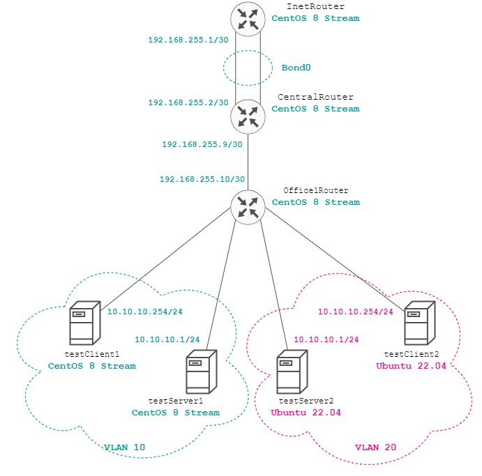

# Otus Homework 24. VLAN.
### Цель домашнего задания
Научиться настраивать VLAN и LACP.
### Описание домашнего задания
в Office1 в тестовой подсети появляются сервера с доп интерфейсами и адресами в internal сети testLAN: 
- testClient1 - 10.10.10.254
- testClient2 - 10.10.10.254
- testServer1- 10.10.10.1 
- testServer2- 10.10.10.1

Равести вланами:  
testClient1 <-> testServer1  
testClient2 <-> testServer2  

Между centralRouter и inetRouter "пробросить" 2 линка (общая inernal сеть) и объединить их в бонд. Проверить работу c отключением интерфейсов
## Выполнение
С помощью Vagrant развернем тестовый стенд. Топология сети представлена на схеме:


### Настройка VLAN
Выполним настройку VLAN на хостах **testClient1** и **testServer1** с операционной системой CenttOS 7. Для этого создадим файл _/etc/sysconfig/network-scripts/ifcfg-vlan10_.
Для сервера **testClient1**:
```bash

```
Для сервера **testServer1** настройка идентичная, но необходимо изменить IP-адрес. Для применения конфигурации необходимо перезапустить служба _NetworkManager_:
```bash
systemctl restart NetworkManager
```
На хостах **testClient2** и **testServer2** с операционной системой Ubuntu 22.04 необходимо настроить конфигурацию netplan. Для testClient2:
```bash

```
Для сервера **testServer1** настройка идентичная, но необходимо изменить IP-адрес. Применим конфигурацию netplan:
```bash
netplan apply
```
После этого хосты **testClient1** и **testServer1** в _VLAN 10_ должны видеть друг друга и не иметь доступа для серверов из _VLAN 20_ и наоборот.


  


### Настройка Bond
Создадим Bond интерфейс на сервера **inetRouter**. Для этого создадим файл _/etc/sysconfig/network-scripts/ifcfg-bond0_ со следующими настройками:
```bash
DEVICE=bond0
NAME=bond0
TYPE=Bond
BONDING_MASTER=yes
IPADDR=192.168.255.1
NETMASK=255.255.255.252
ONBOOT=yes
BOOTPROTO=static
BONDING_OPTS="mode=1 miimon=100 fail_over_mac=1"
NM_CONTROLLED=yes
```
Выбран режим работы _Active-Backup_. Для **centralRouter** необходимо указать IP-адрес 192.168.255.2.  
Далее нужно добавить интерфейсы _eth1_ и _eth2_ в bond интерфейс. Для этого измпеним файлы _ifcfg-eth2_ и _ifcfg-eth2_:
```bash
DEVICE=eth1
ONBOOT=yes
BOOTPROTO=none
MASTER=bond0
SLAVE=yes
NM_CONTROLLED=yes
USERCTL=no
```
После перезапуска службы _NetworkManager_ настройки применятся:
```bash
systemctl restart NetworkManager
```
Проверия работу bond интерфейса. Запустим пинг с **inetRouter** до **centralRouter**, после чего отключим один из физических интерфейсов на **inetRouter**:
```bash
ip link set down eth1
```
